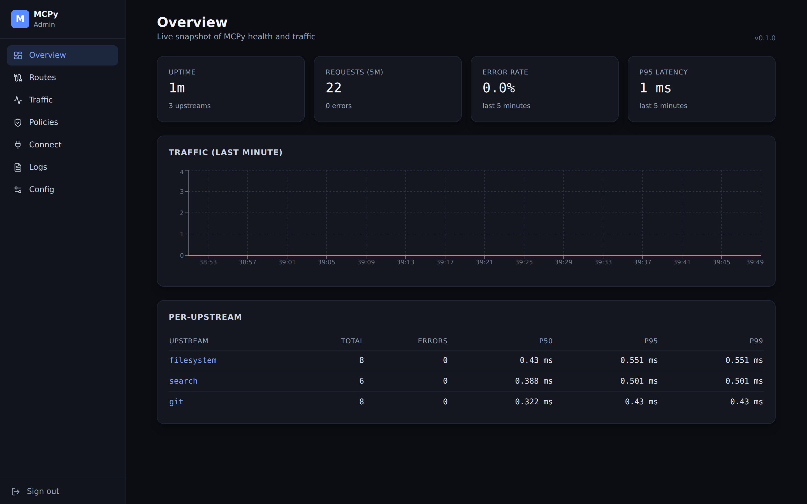
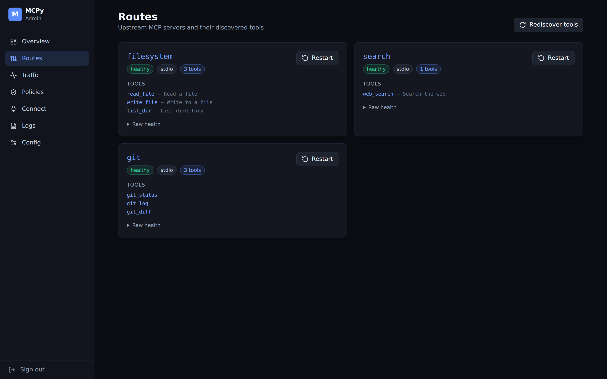
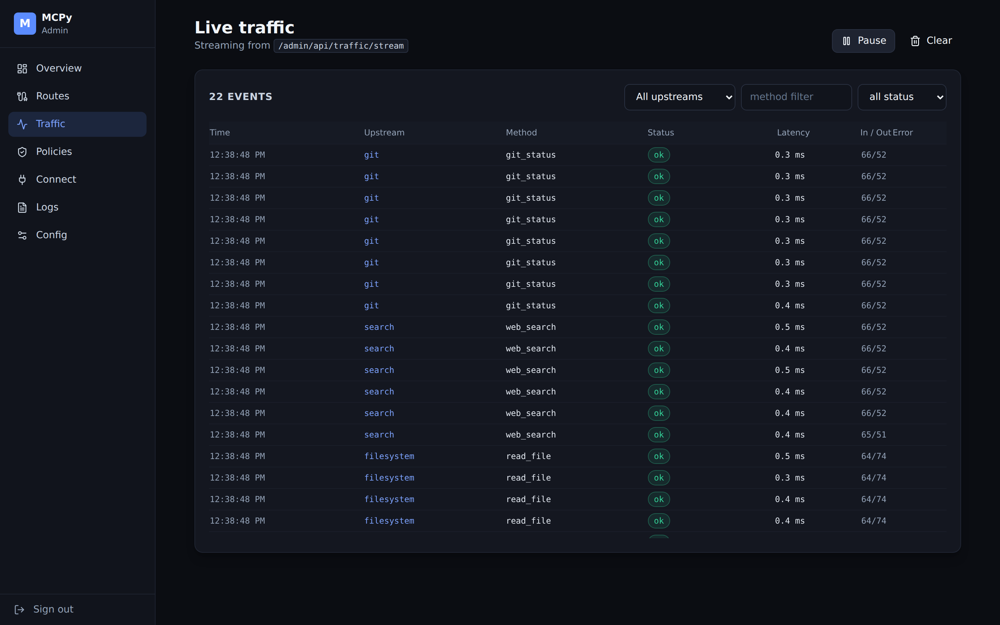
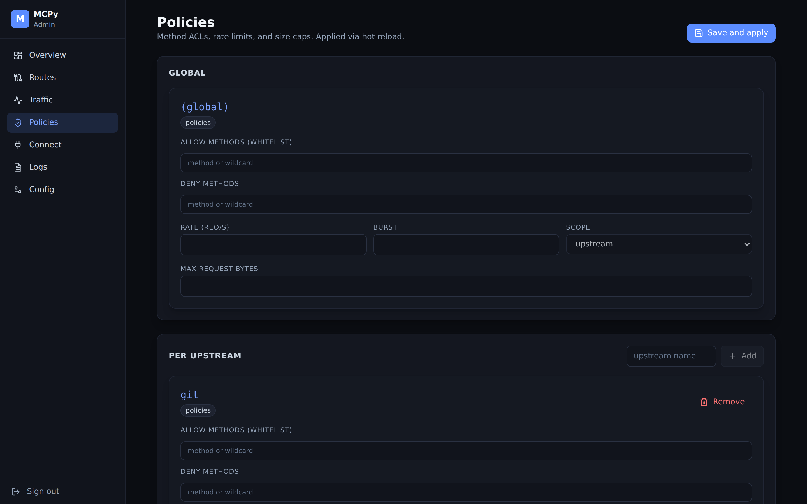
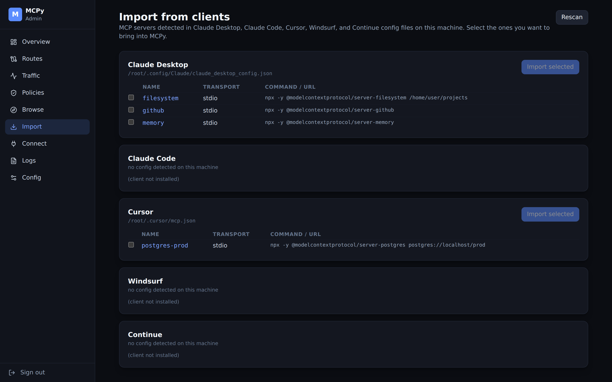
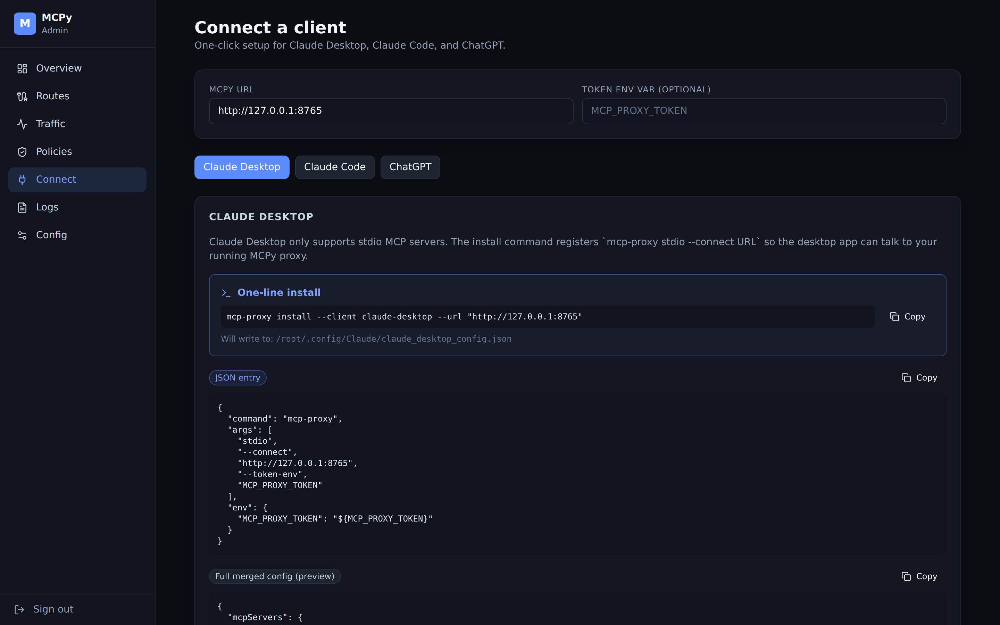

# MCPy — one URL for every MCP server

**Stop configuring the same MCP servers five different ways.** MCPy is a
multi-upstream MCP proxy that sits between your clients (Claude Desktop,
Claude Code, Cursor, Windsurf, Continue, ChatGPT) and every MCP server you
use. Run MCPy once, point every client at it, and manage everything from a
single live dashboard.



## Why MCPy

Every MCP client keeps its own private list of servers. Installing a new
server — or rotating a token, or debugging a misbehaving one — means
editing a JSON file in a different location for each client. MCPy
consolidates that into one endpoint and one dashboard: install servers
from a bundled catalog with one click, see live traffic across every
client, enforce policies, rotate secrets, and hot-reload without
restarting anything.

## Features

- **Multi-upstream MCP proxy** — multiplexes JSON-RPC 2.0 MCP traffic to
  many upstreams (stdio subprocesses or HTTP endpoints) behind one URL,
  with precedence-based routing (path > header > in-band > default).
- **Live dashboard** at `/admin` with 10 pages: Onboarding (first-run
  wizard), Overview, Routes, Traffic, Policies, Browse, Import, Connect,
  Logs, Config. Ships pre-built, so `pip install` gives you a working UI.
- **Bundled catalog** of 14 well-known MCP servers — filesystem, git,
  github, gitlab, memory, postgres, sqlite, brave-search, fetch,
  puppeteer, slack, time, everart, sentry — installable with one click.
- **Import from existing clients** — scans Claude Desktop, Claude Code,
  Cursor, Windsurf, and Continue for servers you already have and
  imports them in one click.
- **One-line installers** for Claude Desktop, Claude Code, and ChatGPT.
  A bundled stdio adapter lets stdio-only clients talk to the HTTP proxy.
- **Policy engine** — per-upstream method ACLs with wildcards,
  token-bucket rate limits, and request-size caps. Edited live and
  hot-reloaded atomically with rollback on failure.
- **Live observability** — every forwarded request is recorded
  (metadata only, never bodies) and streamed to the dashboard over SSE.
  Per-upstream p50/p95/p99 latency, error rate, rolling traffic chart.
- **OAuth 2.1 client** for upstream HTTP MCP servers — discovery
  (RFC 8414), dynamic client registration (RFC 7591), authorization
  code + PKCE (RFC 7636), token refresh with encrypted storage.
- **Encrypted secrets store** (Fernet, rotatable) and a DB-backed
  config store — survives restarts, exports cleanly, atomic apply
  with rollback.

## Quickstart

```bash
pip install mcpy-proxy
mcp-proxy serve
```

Open <http://127.0.0.1:8000/admin>. On first run the Onboarding wizard
generates your admin token, walks you through installing your first MCP
server from the catalog, and hands you the one-line command to connect
your first client. That's it.

Running from source:

```bash
git clone https://github.com/jej2k5/mcpy && cd mcpy
python -m venv .venv && source .venv/bin/activate
pip install -e .[dev]
mcp-proxy serve
```

## Connect a client

```bash
mcp-proxy install --client claude-desktop
mcp-proxy install --client claude-code
mcp-proxy install --client chatgpt
```

Each command backs up the target client's config and registers MCPy as
an MCP server. The dashboard's **Connect** page shows the same commands
and copy-paste snippets for each client.

## Docker

```bash
docker compose up -d
```

The image bundles Node (for `npx`-based catalog entries like
`filesystem`, `github`, `puppeteer`) and `uv`/`uvx` (for Python-based
entries like `mcp-server-git`), so every catalog entry installs from the
dashboard with zero host dependencies. Config is mounted read-only at
`/etc/mcpy/config.json`; runtime state lives in the `mcpy_data` volume.
The install CLI (`mcp-proxy install --client ...`) writes to your host's
client config files and must run on the host, not inside the container.

## Dashboard tour

| Page | |
| --- | --- |
| **Overview** — uptime, total requests, error rate, p95 latency, rolling traffic chart, per-upstream latency table. |  |
| **Routes** — one card per upstream with health, transport, discovered tools, restart button. |  |
| **Traffic** — SSE stream of every forwarded request (metadata only). Filter by upstream, method, status; pause and clear. |  |
| **Policies** — method ACLs, token-bucket rate limits, and size caps. Global and per-upstream, hot-reloaded atomically. |  |
| **Browse** — catalog of 14 well-known MCP servers with search, categories, one-click install with variable prompts. |  |
| **Import** — scans installed clients for MCP servers you already have and brings them in with one click. |  |
| **Connect** — one-click snippets and install commands for Claude Desktop, Claude Code, and ChatGPT. |  |

## Configuration

The active config lives in the local DB (default:
`sqlite:///~/.mcpy/mcpy.db`, override with `MCPY_DB_URL`). Bootstrap
from a JSON file with `mcp-proxy serve --config config.json` on first
run, or `mcp-proxy config import config.json` at any time. A minimal
config looks like:

```json
{
  "default_upstream": "git",
  "auth": {"token_env": "MCP_PROXY_TOKEN"},
  "upstreams": {
    "git": {"type": "stdio", "command": "uvx", "args": ["mcp-server-git", "--repository", "/repo"]},
    "search": {"type": "http", "url": "https://example.com/mcp"}
  }
}
```

See [`docs/Design.md`](docs/Design.md) for the full schema, including
the policy engine, telemetry sinks, admin MCP method reference, plugin
entry points, and architecture diagrams.

## CLI reference

```
mcp-proxy serve                 Run the proxy + dashboard
mcp-proxy init                  Generate a starter config file
mcp-proxy install --client ...  Install MCPy into Claude Desktop / Code / ChatGPT
mcp-proxy stdio --connect URL   Stdio adapter for stdio-only clients
mcp-proxy register --name ...   Register an upstream on a running proxy
mcp-proxy unregister --name ... Remove an upstream
mcp-proxy discover              Scan local clients for MCP servers
mcp-proxy import --client ...   Import upstreams from another client
mcp-proxy catalog list          List bundled catalog entries
mcp-proxy catalog install ID    Install a catalog entry as an upstream
mcp-proxy config show           Print the active DB config as JSON
mcp-proxy config import PATH    Import a JSON config into the DB
mcp-proxy config export PATH    Export the active DB config to JSON
mcp-proxy config history        List recent config applies
mcp-proxy secrets list          List encrypted secrets (values never printed)
mcp-proxy secrets set NAME      Create or rotate a secret
mcp-proxy secrets delete NAME   Delete a secret
```

Drop a JSON file into `~/.mcpy/upstreams.d/` and the running proxy picks
it up on the next poll; delete it to remove the upstream. Useful for
provisioning and CI. All three paths — catalog, import, file-drop — go
through the same atomic apply + rollback pipeline.

## Learn more

- **Architecture & design:** [`docs/Design.md`](docs/Design.md)
- **Contributing:** [`CONTRIBUTING.md`](CONTRIBUTING.md)
- **Security policy:** [`SECURITY.md`](SECURITY.md)
- **Changelog:** [`CHANGELOG.md`](CHANGELOG.md)
- **License:** MIT — see [`LICENSE`](LICENSE)
